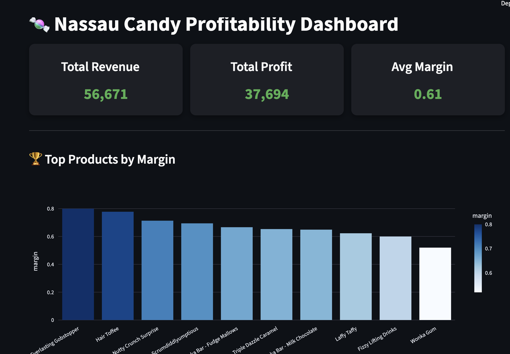
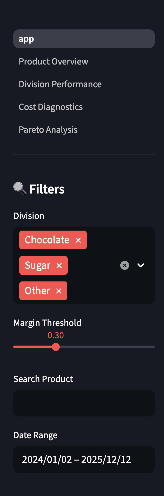
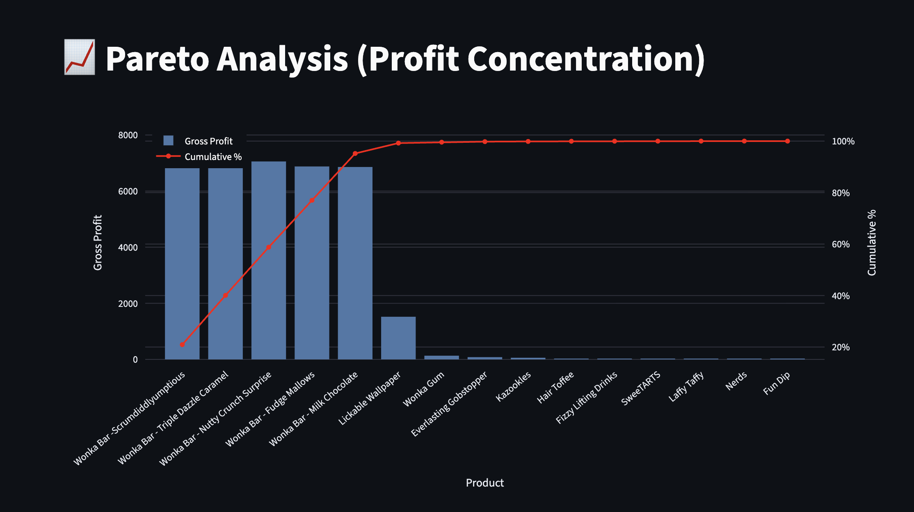

🔗 Live Dashboard: (Will be added after deployment)
# 🏭 Nassau Candy Product Line Profitability Dashboard
An interactive data analytics dashboard to evaluate product profitability, margin performance, and cost efficiency for a candy distribution business.

## 📌 Project Overview

This project analyzes product-level profitability and margin performance for a candy distribution business. The objective is to move beyond sales-based evaluation and identify products that truly drive profit.

The solution is implemented as an interactive Streamlit dashboard, enabling users to explore revenue, cost, and margin relationships across products and divisions for better business decision-making.

---

## 🎯 Business Problem

In many businesses, high sales are often mistaken for strong performance. However, certain products generate high revenue but contribute low profit due to high production or operational costs.

This project addresses the following:

* Which products generate the highest profit and margin?
* Are high-sales products actually profitable?
* How profitability varies across different divisions?
* Which products carry margin risk due to high cost?

---

## 🛠️ Tools & Technologies

* Python
* Pandas
* Plotly
* Streamlit

---

## 📊 Dashboard Features

* 📌 KPI Overview (Total Revenue, Total Profit, Average Margin)
* 🏆 Top Products by Margin
* 📊 Division-wise Performance Analysis
* ⚠️ Cost vs Margin Diagnostics
* 📈 Pareto Analysis (Top 80% Profit Contributors)
* 🔍 Interactive Filters:

  * Division filter
  * Date range selector
  * Margin threshold slider
  * Product search

---

## 📈 Key Insights

* A small percentage of products contribute to the majority of total profit (Pareto effect)
* High sales volume does not always indicate high profitability
* Certain products have high cost structures that reduce margins
* Some divisions generate strong revenue but lower profit efficiency

---

## 📷 Dashboard Preview

### Main Dashboard



### Filters & Controls



### Pareto Analysis



---

## 🚀 How to Run the Project Locally

```bash id="run01"
pip install -r requirements.txt
streamlit run app.py
```

---

## 📂 Project Structure

```id="struct01"
nassau-candy-profitability-dashboard/
│
├── app.py
├── utils.py
├── data/
│   └── product_summary.csv
├── pages/
│   ├── 1_Product_Overview.py
│   ├── 2_Division_Performance.py
│   ├── 3_Cost_Diagnostics.py
│   ├── 4_Pareto_Analysis.py
├── dashboard.png
├── filters.png
├── pareto.png
├── requirements.txt
└── README.md
```

---

## 👩‍💻 Author

Priya Chaudhary

---

## 📌 Project Type

Data Science Internship Project | Business Analytics | Streamlit Dashboard
